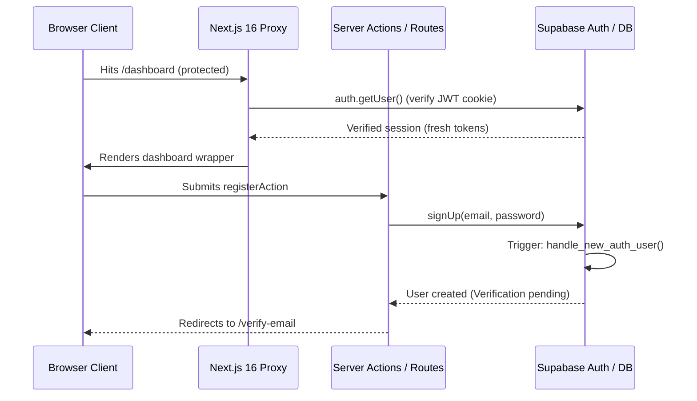

# Authentication Architecture

MotionForge AI implements secure email and password authentication using the Supabase SSR library (`@supabase/ssr`) and Next.js 16 Server Actions.

---

## 1. Flow Overview

---

## 2. Verification Endpoints

- **`/auth/confirm`**: Handles OTP token hash verification links generated by email confirmation templates. Exchanges `token_hash` for a valid cookie session via `supabase.auth.verifyOtp` and directs users.
- **`/auth/callback`**: Handles authorization code PKCE/OAuth redirects from external OAuth systems.

---

## 3. Account Status Guards

Authenticating via Supabase GoTrue is only the first step. For every operational request, server layouts, Server Actions, and database RLS enforce profile validations:

1. **Active status verification**:
   - The user profile must exist in the `public.profiles` database table and carry `status = 'active'`.
   - If suspended (`status = 'suspended'`) or deleted (`status = 'deleted'`), they are logged out on the spot and their operational database access is denied.

2. **Role verification**:
   - Admins are validated in the DB (`profiles.role = 'admin'`). Frontend claims or client cookies are never trusted for authorization checks.

---

## 4. Testing Status

- **Database pre-condition**: Since Docker was not available during testing, real auth signup cycles remain **unverified**. The application will gracefully notify that the migrations are pending when profiles or wallets cannot be queried.
