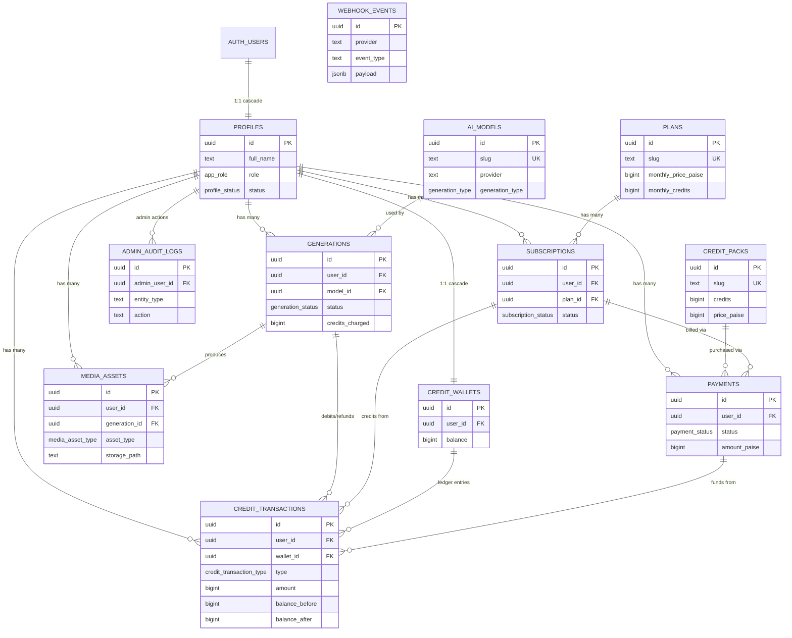

# MotionForge AI — Database Schema

## Overview

MotionForge AI uses Supabase PostgreSQL with Row Level Security (RLS). The schema supports user profiles, credit-based billing, AI generation tracking, media asset management, payment processing, and administrative auditing.

## Entity Relationship Diagram



## Tables

### profiles
User identity linked 1:1 to `auth.users`. Created automatically by `on_auth_user_created` trigger.

| Column | Type | Notes |
|--------|------|-------|
| `id` | uuid PK | References `auth.users(id)` ON DELETE CASCADE |
| `full_name` | text | 1–200 chars, trimmed |
| `avatar_url` | text | Max 2048 chars |
| `role` | app_role | Default `user` |
| `status` | profile_status | Default `active` |
| `deleted_at` | timestamptz | Soft deletion marker |

### plans
Subscription plans with credit allocations.

| Column | Type | Notes |
|--------|------|-------|
| `slug` | text UNIQUE | Lowercase pattern `^[a-z0-9]([a-z0-9-]*[a-z0-9])?$` |
| `monthly_price_paise` | bigint | Nullable — null means pricing TBD |
| `yearly_price_paise` | bigint | Nullable |
| `currency` | text | 3-letter uppercase, default `INR` |
| `monthly_credits` | bigint | ≥ 0 |
| `max_concurrent_generations` | smallint | ≥ 1 |

### credit_packs
One-time credit purchase packages.

| Column | Type | Notes |
|--------|------|-------|
| `credits` | bigint | Must be > 0 |
| `price_paise` | bigint | ≥ 0 |

### credit_wallets
One wallet per user. Balance modified only via server-side RPC (Phase 9).

| Column | Type | Notes |
|--------|------|-------|
| `user_id` | uuid UNIQUE | One wallet per user |
| `balance` | bigint | ≥ 0, default 0 |
| `lifetime_*` | bigint | Cumulative counters, all ≥ 0 |

### subscriptions
Links users to plans via payment providers.

| Key Constraint | Description |
|----------------|-------------|
| Unique partial index `idx_subscriptions_user_active` | One active subscription per user (pending/trialing/active/past_due/paused) |
| `current_period_end >= current_period_start` | Period ordering check |
| ON DELETE RESTRICT on `user_id` and `plan_id` | Preserve billing history |

### ai_models
AI model configurations. Provider-specific options stored in `configuration` jsonb.

| Key Constraint | Description |
|----------------|-------------|
| `is_active = false OR provider_model_id IS NOT NULL` | Active model requires a provider model ID |
| Unique partial index on `(provider, provider_model_id)` | No duplicate provider models |

### generations
AI generation requests with full lifecycle tracking.

| Key Constraint | Description |
|----------------|-------------|
| `progress BETWEEN 0 AND 100` | Progress percentage |
| `prompt` max 5000 chars | Reasonable prompt limit |
| Unique partial `(provider, provider_request_id)` | Provider request dedup |
| Unique partial `(user_id, idempotency_key)` | Client request dedup |
| `deleted_at` | Soft deletion — never hard-delete |
| ON DELETE RESTRICT | Preserve history even if user/model disabled |

### media_assets
Tracks files in Supabase Storage. **Never stores signed URLs** — generate on demand.

| Key Constraint | Description |
|----------------|-------------|
| `UNIQUE (storage_bucket, storage_path)` | No duplicate file references |
| `generation_id` ON DELETE SET NULL | Preserve asset if generation removed |

### credit_transactions
**Immutable append-only ledger.** No `updated_at` column.

| Column | Type | Notes |
|--------|------|-------|
| `amount` | bigint | Signed: positive = credit, negative = debit. Never 0. |
| `balance_before` | bigint | ≥ 0 |
| `balance_after` | bigint | ≥ 0, must equal `balance_before + amount` |
| `idempotency_key` | text | Unique partial index for dedup |

### payments
Payment records from Razorpay. Never stores card details or secrets.

| Key Constraint | Description |
|----------------|-------------|
| `refunded_amount_paise <= amount_paise` | Refund cannot exceed payment |
| Unique partial on provider IDs | Provider dedup |
| ON DELETE RESTRICT on `user_id` | Preserve payment history |

### webhook_events
Webhook event log for idempotent processing. No auth headers stored.

### admin_audit_logs
Immutable admin action audit trail. No `updated_at`.

## Financial Storage Strategy

- All money amounts stored as **bigint in paise** (minor currency units)
- No floating-point money columns
- No PostgreSQL `money` type
- Currency stored as 3-letter ISO code (default `INR`)
- Credit balances are bigint — never nullable, never negative

## Credit Ledger Design

- Append-only: no UPDATE or DELETE allowed on `credit_transactions`
- Every transaction records `balance_before` and `balance_after`
- Constraint enforces: `balance_after = balance_before + amount`
- `amount` is signed (positive = credit in, negative = debit out)
- Idempotency key prevents duplicate transactions
- Wallet balance is the source of truth; transactions are the audit trail

## Media Storage Path Design

- `media_assets` stores `storage_bucket` and `storage_path` — never signed URLs
- Signed URLs are generated on demand with expiry
- `(storage_bucket, storage_path)` has a unique constraint
- Storage buckets are created in Phase 7

## Soft Deletion Strategy

- `profiles.deleted_at` — accounts
- `generations.deleted_at` — generation history
- `media_assets.deleted_at` — uploaded/generated files
- Soft-deleted records remain queryable for admin/audit purposes
- Hard deletion of financial records is prohibited

## Webhook Idempotency

- `(provider, provider_event_id)` unique partial index prevents duplicate processing
- `processing_status` tracks the event lifecycle
- `attempt_count` tracks retry attempts
- `signature_verified` flags cryptographic validation status

## New User Trigger

When `auth.users` receives an INSERT:
1. `private.handle_new_auth_user()` fires (SECURITY DEFINER)
2. Creates one `profiles` row (role=user, status=active)
3. Creates one `credit_wallets` row (balance=0)
4. Uses conflict-safe inserts for idempotency
5. Does NOT grant welcome credits (requires ledger transaction, Phase 9)

## RLS Status

All 12 public tables have RLS **enabled** and strict Row Level Security policies applied in Phase 4. For a complete list of all policies, see [RLS Policy Matrix](file:///Users/amroy/Desktop/motion%20forge%20ai/motionforge-ai/docs/rls-policy-matrix.md).

By default, any access not explicitly allowed by a policy resolves to **DENY**. The `service_role` key bypasses RLS for backend tasks.

## Direct Privilege Revocations

The following tables have explicit `INSERT`, `UPDATE`, and `DELETE` privileges revoked for public roles (`anon` and `authenticated`):
- `credit_wallets` — balance modified only via server RPC (Phase 9)
- `credit_transactions` — append-only database ledger
- `payments` — written only by webhook handlers
- `webhook_events` — written only by webhook handlers
- `admin_audit_logs` — written only by admin server actions

## Applying Migrations

### Local (requires Docker)

```bash
# Start local Supabase
npx supabase start

# Apply all migrations and run seeds
npx supabase db reset

# Run database RLS test suite
npx supabase test db

# Generate TypeScript types
npx supabase gen types typescript --local > src/types/database.ts
```

### Remote (after review)

```bash
# Link to your Supabase project (one-time)
npx supabase link --project-ref YOUR_PROJECT_REF

# Push migrations to remote
npx supabase db push

# Generate types from remote
npx supabase gen types typescript --linked > src/types/database.ts
```

> ⚠️ **Never push migrations to remote without review.**
> ⚠️ **Never run `db reset` on a production database.**

