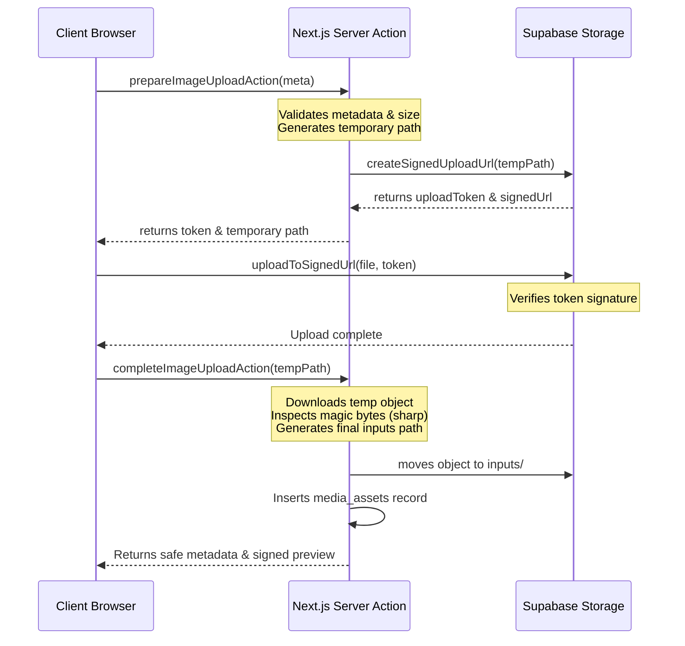

# Storage & Uploads Architecture

This document describes the design, security controls, and processing steps implemented in Phase 7 for secure source image uploads.

---

## 1. Storage Configuration

- **Bucket ID:** `user-media`
- **Visibility:** Private (`public = false`)
- **File Size Limit:** 6 MiB (6,291,456 bytes)
- **Allowed MIME Types:** `image/jpeg`, `image/png`, `image/webp` (Gifs, SVGs, and animations are strictly rejected).

---

## 2. Directory Layout & Paths

All object names in the bucket use owner-prefixed, server-defined paths to prevent collisions and namespace injections:

### 2.1 Temporary Path
```text
users/{userId}/temporary/{uuid}.{extension}
```
Used for direct browser uploads. These objects are not registered in the database yet and are validated as temporary cache.

### 2.2 Final Path
```text
users/{userId}/inputs/{objectId}.{extension}
```
Created on the server *after* validation succeeds. Only final paths are registered in the `media_assets` database ledger.

---

## 3. Direct Browser-to-Storage Upload Flow

To prevent CPU/memory exhaustion on the Next.js server, files bypass Route Handlers and travel directly from the client browser to Supabase Storage:



---

## 4. Server-Side Magic Byte Inspections

We do not trust user-provided extensions or MIME tags. The complete downloaded file is inspected on the server using **`sharp`**:
1. **Magic Bytes Verification:** Discovers actual format types (`jpeg`, `png`, `webp`).
2. **Dimension Constraints:** Enforces minimum 256x256 and maximum 8192x8192 boundaries.
3. **Decompression & Pixel Limits:** Rejects images exceeding 40 million total pixels to prevent decompression-bomb exploits.
4. **Animation Audits:** Checks `metadata.pages` to block animated WebP/multi-page uploads.
5. **SHA-256 Checksums:** Computes and stores file hashes in the database ledger for future integrity audits. No global uniqueness constraints are enforced, ensuring users can legitimately upload duplicate files.

---

## 5. Security & Isolation Controls

- **No General INSERT Policies:** Authenticated users cannot directly select where to upload files. Signed upload tokens are the only mechanism to insert files.
- **Batched SELECT Isolation:** RLS policies on `storage.objects` allow authenticated users to select only objects starting with `users/{auth.uid()}/` and containing `temporary` or `inputs` folders.
- **Database Insertion Isolation:** Row insertion to `media_assets` is blocked for authenticated users. Inserts happen strictly on the server using the service-role client after all checks pass.
- **Short-lived Previews:** Access URLs use `createSignedUrl` with a lifetime of **600 seconds**. Raw signed URLs are never stored in the database.
